# Remaining Useful Life Prediction and Anomaly Detection on N-CMAPSS

**A self supervised TCN Transformer backbone with Sparse Variational Gaussian Process heads for joint turbofan prognostics and diagnostics.**

MSc Artificial Intelligence thesis, School of Computer Science, University of Lincoln (August 2026).
Author: Mohamed Mehdi Benabi. Supervisor: Dr. Heriberto Cuayahuitl Portilla.
The full thesis is included in this repository as [30346363 Thesis.pdf](30346363%20Thesis.pdf).

## Overview

Remaining Useful Life (RUL) estimation and anomaly (health state) detection are usually modelled as two independent problems, even though both describe the same physical degradation process inside the engine. This project asks whether a single representation, learned **without any RUL or health state labels**, can serve both tasks at once.

The work is organised in two stages.

1. **Baselines.** Three independently trained supervised regressors (Vanilla Transformer, Temporal Convolutional Network, Sparse Variational Gaussian Process) are benchmarked for RUL on two sensor configurations, establishing reference accuracy and guiding the choice of backbone.
2. **Main solution.** A hybrid TCN Transformer backbone, selected by an Optuna architecture search, is pretrained with a masked reconstruction objective on unlabelled healthy and degraded flight cycles. Two Sparse Variational Gaussian Process (SVGP) heads are then attached to the shared backbone: a Gaussian likelihood head for RUL regression and a Bernoulli likelihood head for binary health state classification. Both heads return calibrated predictive uncertainty, which matters in a safety critical aeronautical setting.

The selected configuration (DS08 pretraining, physical sensors) reaches a **test RMSE of 6.56 cycles (R² 0.88)** for RUL and **85% accuracy, F1 0.74, AUROC 0.97** for anomaly detection on the unseen DS02 test fleet, from one pretrained representation.

<p align="center"></p>
<p align="center"><em>Figure 1.1: Jet engine maintenance inspection, the operational context motivating predictive maintenance (image credit: AvBuyer, 2019).</em></p>

## Dataset

The project uses the NASA **New Commercial Modular Aero Propulsion System Simulation (N-CMAPSS)** dataset (Arias Chao et al., 2021), which provides run to failure trajectories of large commercial turbofan engines simulated under real recorded flight conditions at 1 Hz. It is distributed as eight sub datasets in HDF5 format.

| Sub dataset | Units | Flight classes | Failure modes | Degraded components |
|:--|:--|:--|:--|:--|
| DS01 | 10 | 1, 2, 3 | 1 | HPT (E) |
| DS02 | 9 | 1, 2, 3 | 2 | HPT (E), LPT (E, F) |
| DS03 | 15 | 1, 2, 3 | 1 | HPT (E), LPT (E, F) |
| DS04 | 10 | 2, 3 | 1 | Fan (E, F) |
| DS05 | 10 | 1, 2, 3 | 1 | HPC (E, F) |
| DS06 | 10 | 1, 2, 3 | 1 | HPC (E, F), HPT (E, F) |
| DS07 | 10 | 1, 2, 3 | 1 | LPT (E, F) |
| DS08 | 54 | 1, 2, 3 | 1 | Fan, LPC, HPC, HPT, LPT (E, F) |

E and F denote efficiency and flow capacity modifiers respectively.

<p align="center">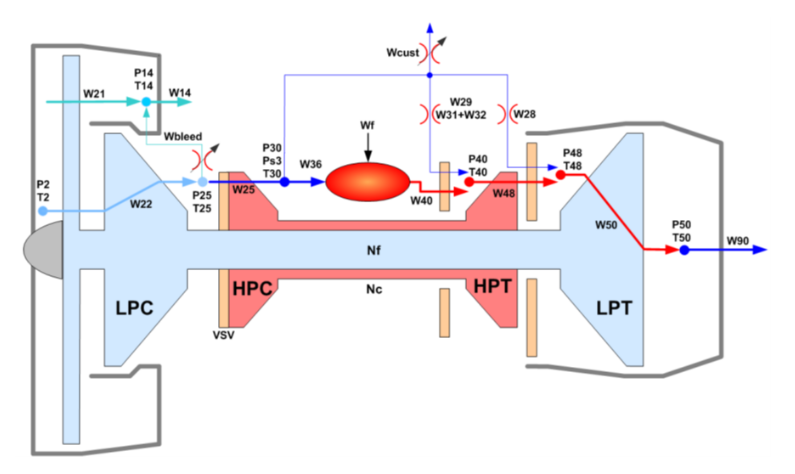</p>
<p align="center"><em>Figure 3.1: Schematic of the simulated turbofan engine with sensor stations (after Arias Chao et al., 2021).</em></p>

Each file contains a development and a test split with scenario descriptors **w** (altitude, Mach, throttle resolver angle, fan inlet temperature), 14 physical sensors **x_s** (fuel flow, shaft speeds, stage temperatures and pressures), 14 virtual sensors **x_v** (stall margins, internal flows, unmeasured temperatures and pressures), health parameters **θ**, the RUL label, and auxiliary data (unit, cycle, flight class, health state `hs`).

### Experimental protocol

| Role | Data |
|:--|:--|
| Self supervised pretraining (DS08 setting) | DS08a and DS08c, roughly 14 million rows (the third DS08 file is corrupted and was excluded) |
| Self supervised pretraining (combined setting) | DS01, DS03, DS04, DS05, DS06, DS07, DS08a, DS08c, roughly 65 million rows |
| Downstream training | DS02 development set, units other than 18 |
| Downstream validation | DS02 development unit 18 |
| Downstream test | DS02 official test set, never used for any model selection |

DS02 is held out from pretraining entirely because it is the only sub dataset with two concurrent failure modes, making it the most demanding transfer target. Unit 18 was chosen for validation because it carries the combined LPT efficiency, LPT flow and HPT efficiency degradation, so it is representative of the hardest pattern in the fleet.

Two sensor configurations are evaluated throughout:

| Configuration | Features | Count |
|:--|:--|:--|
| Physical sensors | w + x_s | 18 |
| All sensors | w + x_s + x_v | 32 |

Virtual sensors are model derived quantities that add realistic complexity, but much of the published literature restricts itself to physical measurements. Running both configurations exposes how the representation reacts to the additional signals.

## Preprocessing

1. **Loading** ([dataloading.py](dataloading.py)). Each HDF5 file is read with `h5py`, and the descriptor, sensor, RUL and auxiliary blocks are concatenated into development and test `DataFrame`s with variable names restored from the `*_var` arrays.
2. **Scaling** ([preprocessing.py](preprocessing.py)). Features are scaled to [0, 1] with `MinMaxScaler` fitted on the training split only and applied to the test split, preventing information leakage. A `StandardScaler` path is also available. Unit, cycle, RUL and `hs` columns are reattached after scaling.
3. **Windowing.** Each engine trajectory is cut into fixed length sliding windows of shape (T, F). The target of a window is the RUL (or `hs`) at its last time step, so every prediction uses only past information. Two implementations are provided:
   1. `create_windows` builds windows eagerly with `numpy.lib.stride_tricks.sliding_window_view`, a zero copy strided view, then subsamples by stride. Used for the baselines.
   2. `CMAPSSWindowed` is a lazy PyTorch `Dataset` that stores one contiguous float32 array per unit and an index of `(unit, start)` pairs, materialising each window only in `__getitem__`. This keeps memory linear in the number of rows rather than in `rows × window_size`, which is what makes pretraining on 65 million rows feasible on a 16 GB machine.
4. **Window size and stride** are treated as hyperparameters and tuned jointly with the models, because they control both the temporal context visible to the network and the degree of overlap (and thus effective sample count and correlation) between training windows.

## Baselines

All baselines are trained for supervised RUL regression on DS02 under identical splits, scaling and evaluation code, so their scores are directly comparable. Implementations live in [Models.py](Models.py) and [Baselines/GP.py](Baselines/GP.py), with one notebook per model and sensor configuration in [Baselines/](Baselines/).

### Vanilla Transformer

`FirstBaseline` projects each window into a d_model dimensional embedding with a linear layer, adds fixed sinusoidal positional encodings, and passes the sequence through a stack of `TransformerEncoderLayer`s (multi head self attention, position wise feed forward, residual connections, layer normalisation, dropout). The output sequence is **mean pooled over time** so that the representation summarises the whole window rather than the last observation, then a two layer MLP regresses RUL.

<p align="center">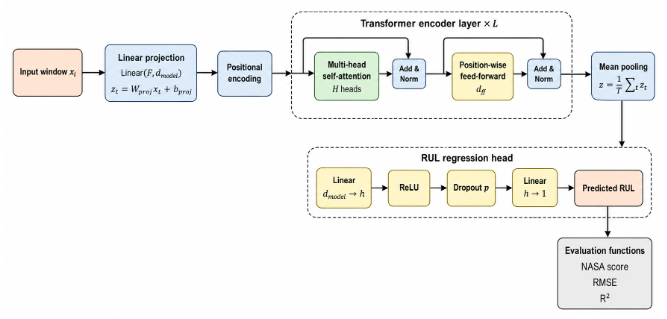</p>
<p align="center"><em>Figure 3.2: Vanilla Transformer baseline architecture.</em></p>

### Temporal Convolutional Network

`TCNRegressor` stacks `TemporalBlock`s, each made of two dilated 1D convolutions with ReLU and dropout and a residual connection (with a 1×1 convolution when channel counts differ). Key design points:

1. **Strict causality.** Convolutions are padded by (k − 1)·d and the `Chomp1d` layer trims the same amount from the right, so the output at time t depends only on inputs at time ≤ t.
2. **Exponential dilation.** Block i uses dilation 2^i, so the receptive field grows as RF = 1 + 2(k − 1)(2^L − 1). With three blocks and kernel size 4 this covers 43 time steps using only six convolutions.
3. **Initialisation.** All convolution weights use Kaiming normal initialisation matched to the ReLU nonlinearity.
4. **Readout.** Because the network is causal, the feature vector at the final time step already summarises the entire receptive field and is used directly as the embedding, with no temporal pooling.

<p align="center">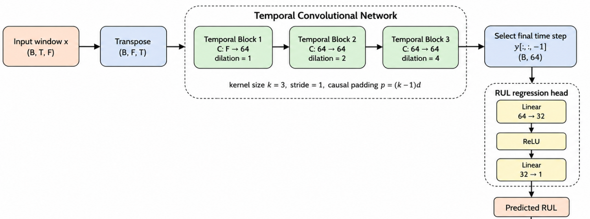</p>
<p align="center"><em>Figure 3.3: Temporal Convolutional Network baseline architecture.</em></p>

<p align="center">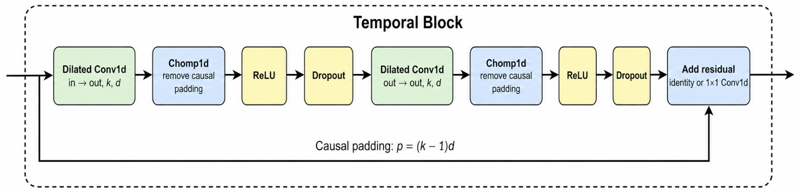</p>
<p align="center"><em>Figure 3.4: Internal structure of a causal Temporal Block.</em></p>

### Sparse Variational Gaussian Process

The SVGP baseline provides a probabilistic reference model with predictive uncertainty. Each window is reduced to a pooled feature vector by averaging over time, giving an (N, F) design matrix.

1. **Sparse approximation.** Exact GP inference costs O(N³), which is intractable here. The posterior is instead summarised by M learnable inducing points Z with inducing outputs u = f(Z), reducing cost to O(NM²) and enabling mini batch training.
2. **Prior.** Constant mean and a scaled **ARD RBF kernel**, with one learnable lengthscale per input dimension so the model can down weight uninformative features.
3. **Variational family.** A Cholesky parameterised Gaussian q(u) = N(m, LLᵀ), with inducing locations learned jointly rather than fixed.
4. **Initialisation.** Inducing points are seeded with KMeans++ centroids fitted on a 20,000 sample subset of the training inputs, so optimisation starts with good coverage of the input distribution.
5. **Objective.** The variational ELBO, Σ E_q[log p(yᵢ | f(xᵢ))] − KL[q(u) ‖ p(u)], is maximised with stochastic mini batch updates and patience based early stopping.
6. **Prediction.** The predictive distribution is Gaussian in closed form, yielding a posterior mean (RUL estimate) and variance (uncertainty band). Prediction is batched to avoid materialising a full test kernel matrix.

<p align="center">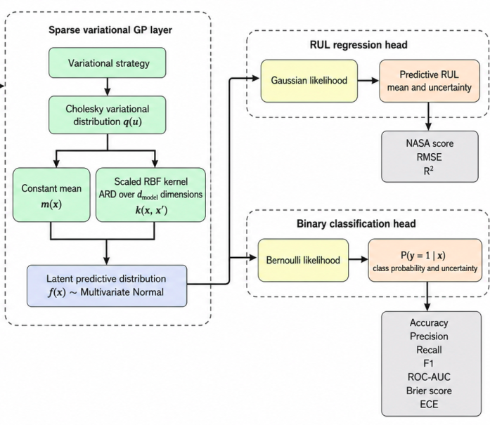</p>
<p align="center"><em>Figure 3.5: Sparse Variational Gaussian Process architecture for regression and classification.</em></p>

### Baseline training procedure

Neural baselines are optimised with AdamW and MSE loss, `ReduceLROnPlateau` (factor 0.5, patience 5, floor 10⁻⁷), gradient norm clipping at 5.0, and early stopping on validation loss (patience 5) with automatic restoration of the best checkpoint. Optuna searches over learning rate, weight decay, dropout, batch size, window size, stride, epochs and the architectural hyperparameters of each model.

### Baseline results on DS02 test set

| Model | Sensors | Test RMSE | NASA score (total) | NASA score (mean) |
|:--|:--|:--|:--|:--|
| Vanilla Transformer | Physical | 6.30 | 61,024 | 0.730 |
| Vanilla Transformer | All | 8.34 | 105,511 | 1.263 |
| TCN | Physical | 5.50 | 42,818 | 0.512 |
| **TCN** | **All** | **5.20** | 45,030 | 0.539 |
| SVGP | Physical | 8.40 | 97,805 | n/a |
| SVGP | All | 6.92 | 66,934 | n/a |

The TCN was the most accurate baseline in both configurations. The Transformer degraded noticeably when virtual sensors were added, while the SVGP improved with them and additionally produced uncertainty estimates (mean predictive standard deviation around 9.4 to 9.5 cycles) at sub second inference time. These observations motivated combining convolutional local feature extraction with attention based global context in the main backbone, and using SVGP layers as uncertainty aware heads.

#### Baseline test set predictions

<p align="center">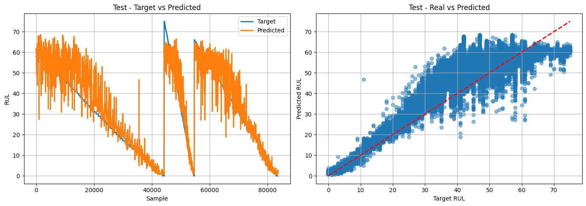</p>
<p align="center"><em>Figure 5.2: Vanilla Transformer on physical sensors, predicted versus target RUL across test units and as a scatter plot.</em></p>

<p align="center">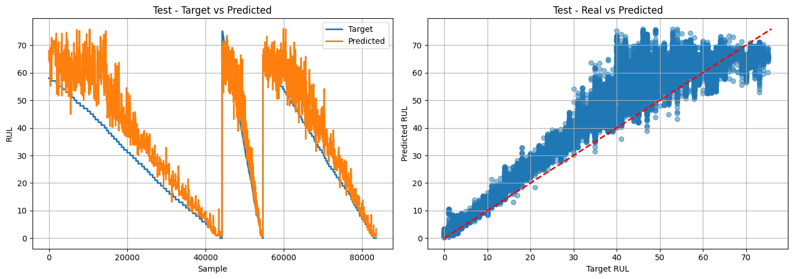</p>
<p align="center"><em>Figure 5.3: Vanilla Transformer on all sensors.</em></p>

<p align="center">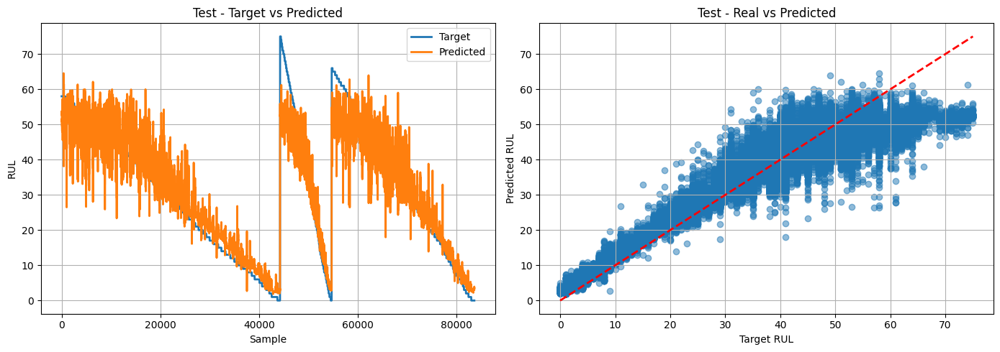</p>
<p align="center"><em>Figure 5.4: TCN on physical sensors.</em></p>

<p align="center">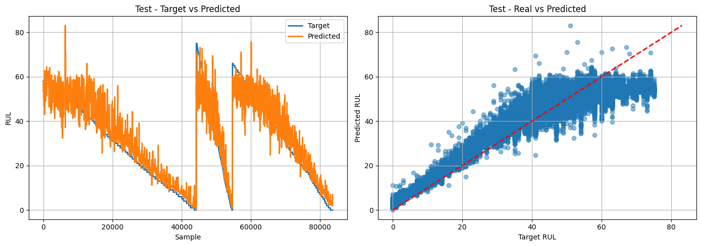</p>
<p align="center"><em>Figure 5.5: TCN on all sensors.</em></p>

<p align="center">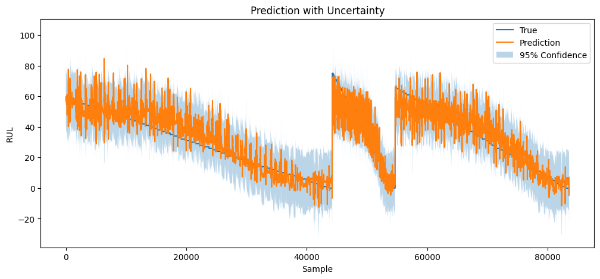</p>
<p align="center"><em>Figure 5.6: SVGP on all sensors, posterior mean with 95% confidence band.</em></p>

## Main Solution: Self Supervised Backbone with SVGP Heads

### Architecture

<p align="center">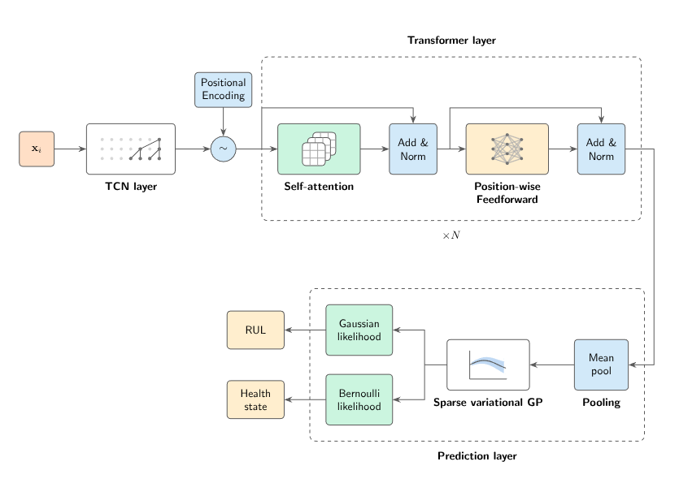</p>
<p align="center"><em>Figure 3.6: Proposed hybrid TCN Transformer backbone with SVGP regression and classification heads.</em></p>

The data flow, in compact form:

```
 Input window (B, T, F)
        │
        ▼
 ┌─────────────────────────────┐
 │ Causal dilated TCN blocks   │   local temporal features, residual, Kaiming init
 └─────────────────────────────┘
        │  linear projection to d_model
        ▼
 ┌─────────────────────────────┐
 │ Sinusoidal positional enc.  │
 │ Transformer encoder × L     │   global dependencies across the window
 └─────────────────────────────┘
        │
        ├── z_seq (B, T, d_model) ──► Reconstruction MLP ──► masked sensor values   (pretraining)
        │
        └── z_pool = mean over time (B, d_model)
                  │
                  ├──► SVGP + Gaussian likelihood  ──► RUL mean and variance
                  └──► SVGP + Bernoulli likelihood ──► P(healthy) with calibration
```

The **`TCNTransformerBackbone`** first applies causal dilated temporal blocks that act as learned, multiscale filters over the raw sensor streams, then projects to d_model and feeds the sequence to a Transformer encoder that models long range interactions between time steps. It returns both the full sequence embedding `z_seq` (used for reconstruction) and a mean pooled embedding `z_pool` (used by the heads). Standalone `TCNBackbone` and `TransformerBackbone` variants share the same interface so that all three can compete in the architecture search.

### Stage 1: Masked reconstruction pretraining

`MaskedReconstructionSSL` wraps the backbone with a two layer reconstruction MLP. For each batch X ∈ ℝ^{B×T×F} a binary mask M is drawn element wise with Mᵦₜf ~ Bernoulli(r), masked entries are set to zero, and the network must recover them from the surrounding context in both time and sensor dimensions. The loss is the **masked MSE**, computed only over masked positions,

L = (1 / ‖M‖₁) Σ Mᵦₜf (X̂ᵦₜf − Xᵦₜf)²

with masked MAE reported as an interpretable companion metric. Unmasked entries are excluded because reconstructing visible inputs requires no inference and would dilute the learning signal.

Pretraining deliberately uses **both healthy and degraded cycles**. Prior work that learns normality from healthy data only tends to be weak early in an engine's life, where degradation signal is faint. Exposing the backbone to the full trajectory forces it to encode the operating regime as well as the gradual drift caused by component wear, which is exactly the information both downstream tasks need. No RUL or `hs` label is ever seen at this stage.

**Optuna Study 1** (15 trials, 8 epochs each, per sensor configuration) jointly searched the backbone type (TCN, Transformer, hybrid), window size, stride ratio, mask ratio, learning rate, weight decay, batch size, dropout and the architecture specific dimensions, minimising validation masked MSE. The **hybrid TCN Transformer won in every configuration**. The winning configuration was then retrained for up to 50 epochs with early stopping.

Selected pretraining configurations on DS08:

| Hyperparameter | All sensors | Physical sensors |
|:--|:--|:--|
| Window / stride | 100 / 30 | 50 / 20 |
| Mask ratio | 0.50 | 0.24 |
| Learning rate | 2.3 × 10⁻³ | 3.8 × 10⁻⁴ |
| Weight decay | 3.9 × 10⁻⁶ | 5.0 × 10⁻⁶ |
| Dropout | 0.22 | 0.17 |
| TCN channels | 64 | 64 |
| d_model / heads / layers / d_ff | 128 / 8 / 2 / 128 | 32 / 2 / 3 / 128 |
| Final validation masked MSE | 3.75 × 10⁻³ | 4.0 × 10⁻⁵ |
| Pretraining time | 954 s | 1,192 s |

<p align="center">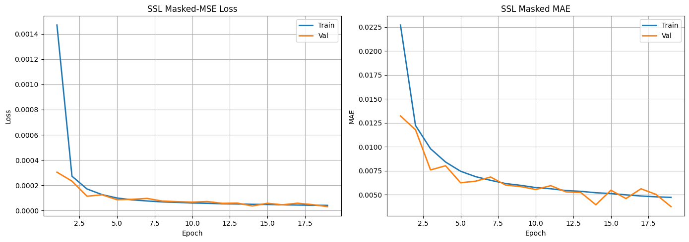</p>
<p align="center"><em>Figure 5.7: Masked reconstruction loss and MAE during pretraining on DS08, all sensors.</em></p>

<p align="center">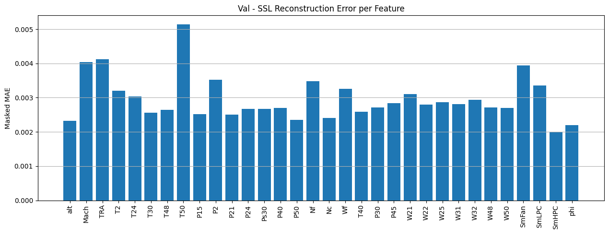</p>
<p align="center"><em>Figure 5.8: Per feature masked reconstruction error on the validation set, DS08, all sensors.</em></p>

For the combined 65 million row setting, the search was constrained to three scaled presets (Light: d_model 64, Medium: d_model 128, Large: d_model 256 with 512 dimensional feed forward and 256 TCN channels). Optuna selected the Large preset for all sensors (window 50, stride 15, mask ratio 0.4, 4 encoder layers, roughly 9,100 s of pretraining) and the Medium preset for physical sensors.

<p align="center">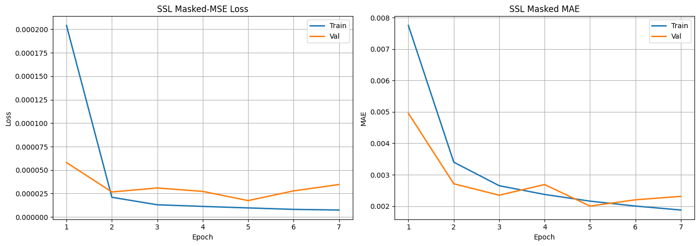</p>
<p align="center"><em>Figure 5.15: Masked reconstruction loss and MAE during pretraining on the combined dataset, all sensors.</em></p>

<p align="center">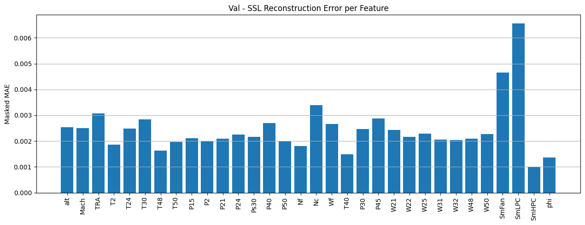</p>
<p align="center"><em>Figure 5.16: Per feature masked reconstruction error, combined dataset, all sensors.</em></p>

<p align="center">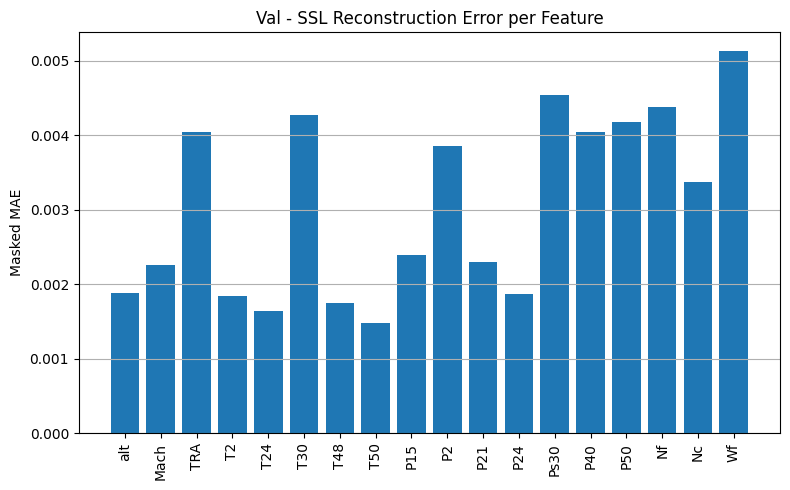</p>
<p align="center"><em>Figure 5.20: Per feature masked reconstruction error, combined dataset, physical sensors.</em></p>

### Stage 2: Transfer to probabilistic heads

The pretrained backbone is loaded into each head with `load_backbone_weights`, which strips the `backbone.` prefix from the SSL checkpoint and optionally freezes all backbone parameters. Each head places an `SVGPLayer` (ARD RBF kernel, Cholesky variational distribution, learnable inducing locations) on top of the pooled embedding `z_pool`.

1. **Inducing point initialisation in latent space.** `init_inducing_points` runs the pretrained backbone over up to 20,000 training windows and seeds the inducing points with KMeans++ centroids of the resulting embeddings. Because the backbone has already organised windows by operating regime and degradation level, these centroids give the GP a well spread, semantically meaningful basis from the first step.
2. **RUL head (`RULHead`).** Gaussian likelihood with learned observation noise. The output is a full predictive distribution, so each RUL estimate comes with a standard deviation usable for maintenance risk assessment.
3. **Anomaly detection head (`BinaryClassificationHead`).** Bernoulli likelihood with a probit link, predicting the ground truth health state flag `hs` provided by N-CMAPSS rather than an arbitrary RUL threshold. The predicted probability integrates over the latent GP uncertainty, which tends to produce better calibrated outputs than a deterministic sigmoid.
4. **Deep kernel learning.** When the backbone is not frozen, its weights and all GP hyperparameters (lengthscales, output scale, inducing locations, variational parameters, likelihood noise) are optimised jointly by maximising the variational ELBO. This effectively learns the kernel's feature map end to end on top of the self supervised initialisation.

**Optuna Study 2** tuned each head over number of inducing points (100 to 1,000), learning rate, weight decay, batch size and the choice between a frozen and a fine tuned backbone. The objective was validation RMSE for the RUL head and validation **F1 score** for the classifier, since the health state labels are imbalanced and accuracy alone would reward predicting the majority class.

## Results

All reported numbers are on the untouched DS02 test fleet.

<p align="center">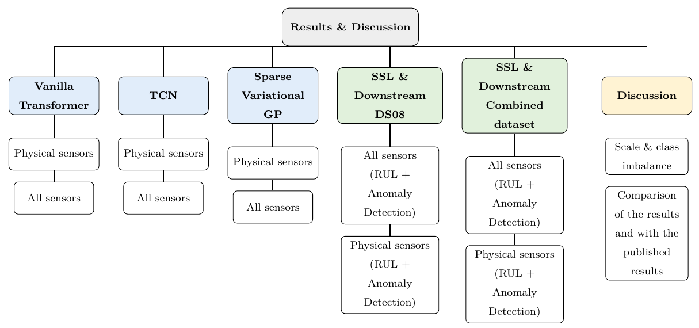</p>
<p align="center"><em>Figure 5.1: Organisation of the experiments reported in the thesis.</em></p>

### RUL regression head

| Pretraining data | Sensors | Backbone | Inducing pts | Test RMSE | R² | NASA total | Mean pred. std |
|:--|:--|:--|:--|:--|:--|:--|:--|
| DS08 | All | Fine tuned | 400 | **5.29** | **0.92** | 44,911 | 5.90 |
| DS08 | Physical | Fine tuned | 100 | 6.56 | 0.88 | 48,239 | 5.10 |
| Combined | All | Frozen | 1,000 | 6.66 | 0.88 | 64,180 | 5.22 |
| Combined | Physical | Frozen | 400 | 8.96 | 0.78 | 113,673 | 5.82 |

Each test figure shows, from left to right, predicted versus target RUL across the test trajectories, the predicted versus true scatter, the residual distribution, and the posterior mean with its uncertainty band.

**DS08, all sensors**

<p align="center">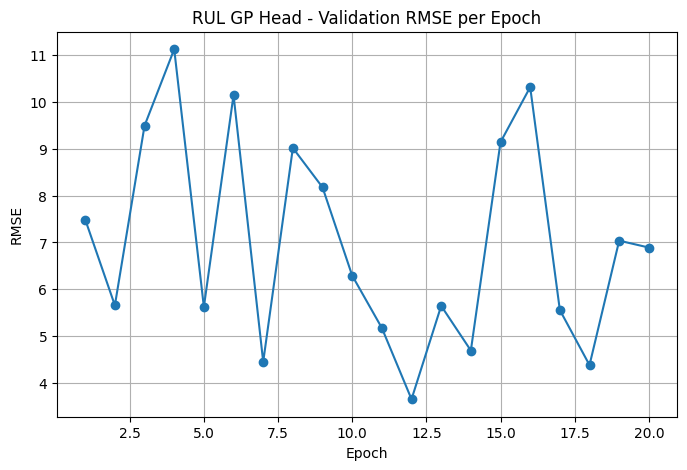</p>
<p align="center"><em>Figure 5.9: RUL head validation RMSE per epoch.</em></p>

<p align="center">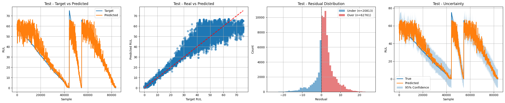</p>
<p align="center"><em>Figure 5.10: RUL head on the held out test set.</em></p>

**DS08, physical sensors (selected configuration)**

<p align="center">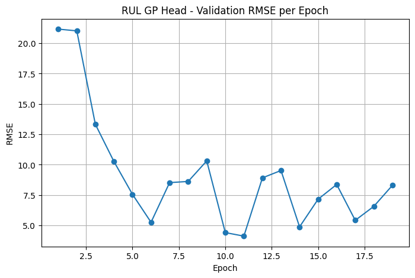</p>
<p align="center"><em>Figure 5.12: RUL head validation RMSE per epoch.</em></p>

<p align="center">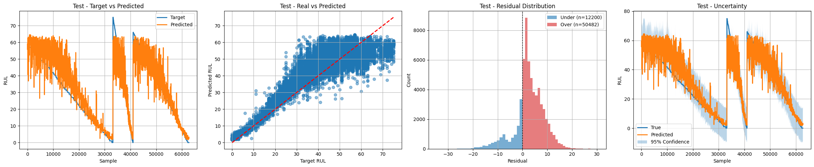</p>
<p align="center"><em>Figure 5.13: RUL head on the held out test set.</em></p>

**Combined dataset, all sensors**

<p align="center">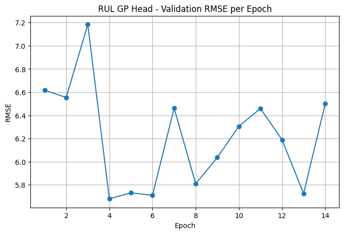</p>
<p align="center"><em>Figure 5.17: RUL head validation RMSE per epoch.</em></p>

<p align="center">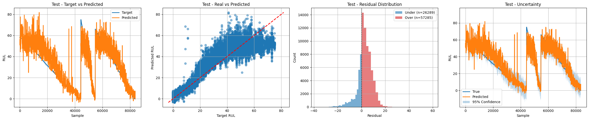</p>
<p align="center"><em>Figure 5.18: RUL head on the held out test set.</em></p>

**Combined dataset, physical sensors**

<p align="center">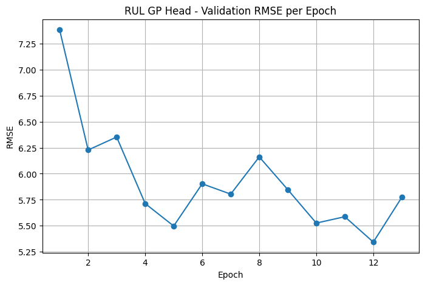</p>
<p align="center"><em>Figure 5.21: RUL head validation RMSE per epoch.</em></p>

<p align="center">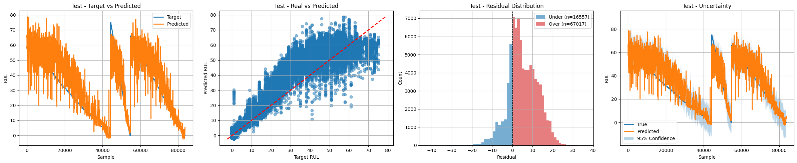</p>
<p align="center"><em>Figure 5.22: RUL head on the held out test set.</em></p>

### Anomaly detection head

| Pretraining data | Sensors | Accuracy | Precision | Recall | F1 | AUROC | Brier | ECE |
|:--|:--|:--|:--|:--|:--|:--|:--|:--|
| **DS08** | **Physical** | **0.85** | 0.95 | **0.61** | **0.74** | 0.97 | **0.11** | 0.07 |
| DS08 | All | 0.77 | 0.98 | 0.35 | 0.51 | 0.98 | 0.13 | 0.09 |
| Combined | Physical | 0.80 | 0.96 | 0.43 | 0.60 | 0.97 | 0.12 | 0.05 |
| Combined | All | 0.70 | 0.98 | 0.14 | 0.25 | 0.98 | 0.16 | 0.17 |

On the selected configuration the classifier produced 40,297 true negatives, 13,246 true positives, only 736 false positives and 8,403 false negatives.

Each figure shows the confusion matrix, the ROC curve and the reliability (calibration) diagram on the held out test set.

<p align="center">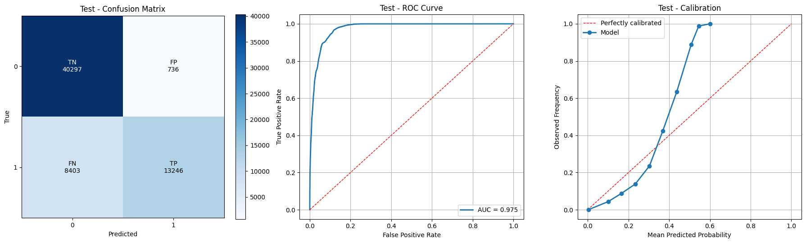</p>
<p align="center"><em>Figure 5.14: Anomaly detection head, DS08, physical sensors (selected configuration).</em></p>

<p align="center">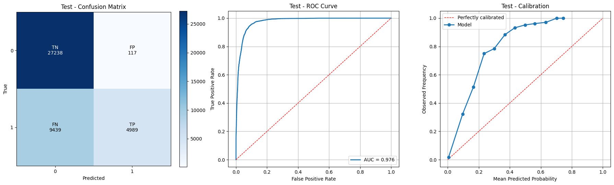</p>
<p align="center"><em>Figure 5.11: Anomaly detection head, DS08, all sensors.</em></p>

<p align="center">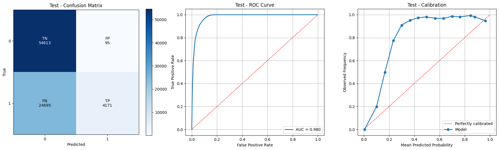</p>
<p align="center"><em>Figure 5.19: Anomaly detection head, combined dataset, all sensors.</em></p>

### Selected configuration

The DS08, physical sensors model is retained as the headline result. The all sensors model has the best RUL accuracy (RMSE 5.29, essentially matching the best supervised baseline at 5.20 without using any labels during pretraining), but its classifier recall drops to 0.35. The physical sensors model is the only configuration that is strong on **both** tasks simultaneously, which is the actual objective of a shared representation.

### Comparison with published work on N-CMAPSS DS02

| Model | Reference | RMSE |
|:--|:--|:--|
| Hybrid Transformer | Du et al., 2025 | 3.71 |
| SCTA LSTM | Tian, Yang and Ju, 2023 | 4.15 |
| Input Attention LSTM | Song et al., 2021 | 4.32 |
| Deep GP | Zeng and Liang, 2022 | 6.17 |
| **Proposed (DS08, physical)** | this work | **6.56** |
| Graph Transformer | Xiang et al., 2023 | 6.86 |
| MC Dropout | Biggio et al., 2021 | 7.31 |

The proposed model outperforms the Graph Transformer and MC Dropout approaches, and the all sensors variant (5.29) also outperforms the Deep GP. Unlike the fully supervised leaders, it learns its representation without labels, serves two tasks from one backbone, and reports predictive uncertainty for every estimate. Note that the published works typically use a plain train and test split, whereas this project additionally holds out unit 18 for validation, so the training set is slightly smaller while the test set is identical.

## Analysis

**Representation quality versus decision threshold.** AUROC remains between 0.97 and 0.98 in every configuration, including those with poor recall. The pretrained embedding therefore ranks healthy and degraded windows almost perfectly; the weakness lies in the operating point. Precision stays at 0.95 to 0.98 while recall varies widely, which is the signature of a threshold biased toward the majority class rather than a failure of representation learning.

**Scaling the pretraining corpus hurt performance.** Moving from DS08 alone to seven combined sub datasets (about 65 million rows) worsened every metric: RUL RMSE rose from 5.29 to 6.66 (all sensors) and from 6.56 to 8.96 (physical sensors), and recall fell from 0.35 to 0.14 and from 0.61 to 0.43. The combined corpus is about 70% unhealthy (28.1 M versus 10.9 M rows in training), and each added sub dataset introduces a different isolated failure mode. The backbone becomes dominated by degraded regimes and by fault signatures absent from the DS02 target, while the heads, trained on an imbalanced label distribution, shift their decision boundary further toward the unhealthy class. More data without rebalancing or domain alignment was actively counterproductive.

**NASA score versus RMSE.** The selected model has a moderate RMSE but a comparatively high NASA score. Because the score penalises late predictions (over estimating remaining life, a₂ = 10) more steeply than early ones (a₁ = 13), this indicates that residual errors are skewed toward optimistic RUL estimates, which is the more costly direction operationally and a clear target for an asymmetric training loss.

**Sensor configuration trade off.** Virtual sensors help RUL regression (5.29 versus 6.56) but hurt health state classification (F1 0.51 versus 0.74). The extra channels carry fine grained degradation information useful for a continuous target, yet appear to make the binary boundary harder to place, again showing that the best configuration for one task is not necessarily the best for the joint objective.

## Limitations and Future Work

1. The self supervised RUL head on the selected configuration (6.56) does not surpass the best supervised TCN baseline (5.50 on physical sensors), and no single configuration is best on both tasks.
2. Class imbalance should be addressed directly: oversampling or synthesising healthy cycles, undersampling unhealthy ones, class weighted or focal likelihoods, and decision threshold tuning on the validation set to convert the high AUROC into high recall.
3. Training the two heads jointly with a multi task loss, rather than tuning each independently on a shared backbone, may let gradient signal from one task regularise the other.
4. An asymmetric regression objective aligned with the NASA scoring function could reduce optimistic RUL errors.

## Repository Structure

<p align="center">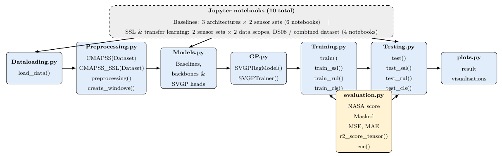</p>
<p align="center"><em>Figure 4.1: Module level overview of the codebase and the dependency flow between components.</em></p>

```
.
├── 30346363 Thesis.pdf                         Full MSc thesis
├── figures/                                    Figures extracted from the thesis
├── dataloading.py                              HDF5 loading into DataFrames
├── preprocessing.py                            Datasets, scaling, eager and lazy windowing
├── Models.py                                   Baselines, backbones, SSL wrapper, SVGP heads
├── Training.py                                 train, train_ssl, train_rul, train_cls
├── Testing.py                                  test, test_ssl, test_rul, test_cls
├── evaluation.py                               NASA score, masked MSE and MAE, R², ECE
├── plots.py                                    Regression, classification and SSL diagnostics
├── Baselines/
│   ├── GP.py                                   SVGP baseline trainer and pipeline
│   ├── GP-run.ipynb
│   ├── Vanilla-FullScenario-physical-sensors.ipynb
│   ├── Vanilla-FullScenario-all-sensors.ipynb
│   ├── TCN-FullScenario-physical-sensors.ipynb
│   └── TCN-FullScenario-all-sensors.ipynb
├── Notebooks /
│   ├── DS8/
│   │   ├── SSL-Pipeline-Physical-Sensors.ipynb
│   │   └── SSL-Pipeline-All-Sensors.ipynb
│   └── All dataset/
│       ├── SSL-All-data-Physical-Sensors.ipynb
│       └── SSL-All-data-All-Sensors.ipynb
├── Models of the DS8 Physical Sensors/         Selected model checkpoints
├── Models of the DS8 All Sensors/
├── Models of the Combined Data Physical Sensors/
└── Models of the Combined Data All Sensors/
```

Each checkpoint folder contains three PyTorch state dicts: the pretrained SSL backbone (`*_ssl_backbone_*.pt`), the RUL head (`*_rul_gp_head_*.pt`) and the anomaly detection head (`*_cls_gp_head_*.pt`).

### Evaluation utilities

| Function | Purpose |
|:--|:--|
| `nasa_score_tensor` | Asymmetric PHM scoring function, exp(−Δ/13) − 1 for early and exp(Δ/10) − 1 for late predictions |
| `masked_mse`, `masked_mae` | Reconstruction error restricted to masked entries |
| `r2_score_tensor` | Coefficient of determination on tensors |
| `expected_calibration_error` | 15 bin ECE on the confidence of the predicted class |
| `test_cls` | Accuracy, precision, recall, F1, AUROC, Brier score and ECE |
| `test_rul` | RMSE, R², NASA score and per sample predictive standard deviation |

[plots.py](plots.py) provides predicted versus true scatter plots, residual analysis, uncertainty bands, training curves, confusion matrices, ROC and reliability diagrams, and per feature reconstruction error for SSL diagnostics.

## Reproducing the Experiments

### Requirements

Python 3.10 or later with:

```
torch  gpytorch  optuna  numpy  pandas  scikit-learn  h5py  matplotlib  seaborn
```

Experiments were run on a single NVIDIA RTX 4060 Ti with an Intel Core i5 (11th generation) and 16 GB RAM.

### Data

Download N-CMAPSS from the NASA Prognostics Center of Excellence data repository and place the HDF5 files (for example `N-CMAPSS_DS02-006.h5`, `N-CMAPSS_DS08a-009.h5`, `N-CMAPSS_DS08c-008.h5`) in a directory referenced by `DATA_DIR` in the notebooks. The dataset is not redistributed in this repository.

### Workflow

1. Run the notebooks in [Baselines/](Baselines/) to reproduce the supervised Transformer, TCN and SVGP results for each sensor configuration.
2. Run the notebooks in [Notebooks /DS8/](Notebooks%20/DS8/) or [Notebooks /All dataset/](Notebooks%20/All%20dataset/). Each notebook follows the same sequence: environment check, data loading and scaling, Optuna Study 1 for the SSL backbone, final pretraining, Optuna Study 2 for the RUL head, final RUL training, then the same two steps for the anomaly detection head, followed by test set evaluation and plots.
3. To evaluate without retraining, build the backbone with the hyperparameters listed above, load the provided checkpoints, and call `test_rul` or `test_cls` from [Testing.py](Testing.py).

## Citation

```
Benabi, M. M. (2026). Remaining Useful Life Prediction and Anomaly Detection using N-CMAPSS.
MSc Artificial Intelligence Thesis, School of Computer Science, University of Lincoln.
```

## References

Arias Chao, M., Kulkarni, C., Goebel, K. and Fink, O. (2021). Aircraft engine run to failure dataset under real flight conditions for prognostics and diagnostics. *Data*, 6(1), 5.

Biggio, L. et al. (2021). Uncertainty aware prognosis via deep Gaussian process. *IEEE Access*, 9, 123517 to 123527.

Du, N. H. et al. (2025). Remaining useful lifetime prediction of turbofan engines based on hybrid Transformer deep architecture. Preprint.

Akiba, T., Sano, S., Yanase, T., Ohta, T. and Koyama, M. (2019). Optuna: A next generation hyperparameter optimization framework. *KDD*.

The complete bibliography is available in the thesis.
